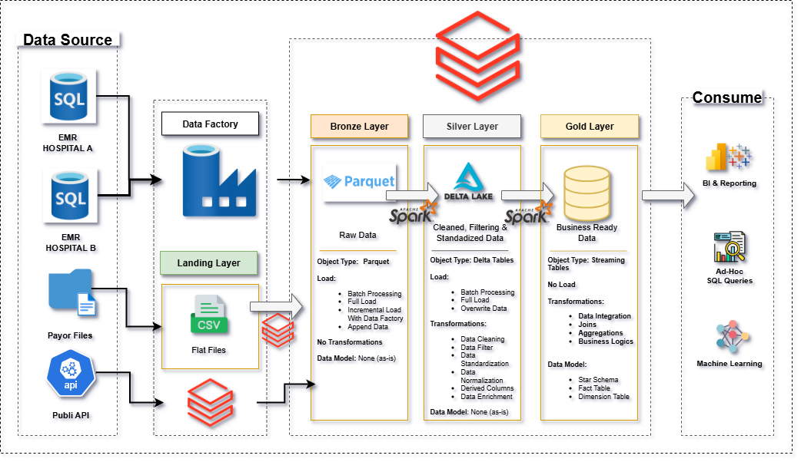

# Azure Healthcare Medallion Pipeline

This repository contains a complete Azure Data Engineering project that processes Electronic Medical Records (EMR), Claims, and Medical Code data using the **Medallion Architecture** (Landing → Bronze → Silver → Gold). 

It integrates various Azure services to build a modern data platform for healthcare analytics, including **Azure SQL**, **ADLS Gen2**, **Azure Data Factory**, **Azure Databricks**, **Unity Catalog**, and **Key Vault**.

---

## 🚀 Architecture Overview

---

## 📁 Data Sources

| Source Type | Details |
|-------------|---------|
| EMR         | Azure SQL DB (Hospital A & B) |
| Claims      | Flat files (CSV) in landing zone |
| NPI/ICD     | Public APIs |
| CPT Codes   | Flat files (CSV) |

---

## ⚙️ Tech Stack

- **Azure Data Factory** – Data ingestion pipelines
- **Azure SQL DB** – Source system for EMR
- **ADLS Gen2** – Storage for raw, bronze, silver, and gold data
- **Azure Databricks** – Data transformation using PySpark
- **Delta Lake + Unity Catalog** – Silver & Gold tables with governance and SCD2 handling
- **Azure Key Vault** – Secure storage of credentials

---

## 🔄 Pipeline Flow

1. **ADF Pipeline** reads `configs/emr/load_config.csv` and ingests EMR data.
2. EMR, Claims, NPI, ICD, and CPT data are moved to **Bronze (Parquet)**.
3. In **Databricks**, data is cleaned and standardized into **Silver (Delta with Unity Catalog)**.
4. SCD2 logic applied on dimension tables (e.g., patients, transactions).
5. **Gold Layer** builds fact/dimension tables for reporting and ML.

---

## ✅ Key Features

- 🧱 Medallion Architecture with clear separation of layers
- 🏥 EMR + Claims + Code Systems integration
- 🧪 Data Quality Checks (is_quarantined)
- ♻️ SCD2 (Slowly Changing Dimension) for key tables
- 🔐 Azure Key Vault for secret management
- ⚡ Parallelized ADF pipelines for improved performance
- 🧭 Unity Catalog for secure, governed data access

---
